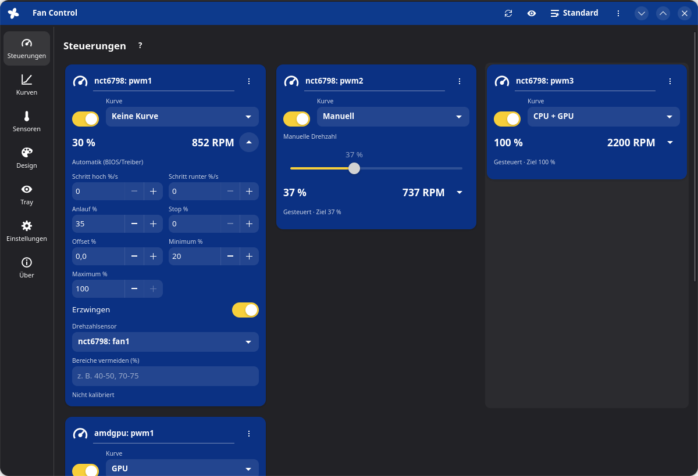
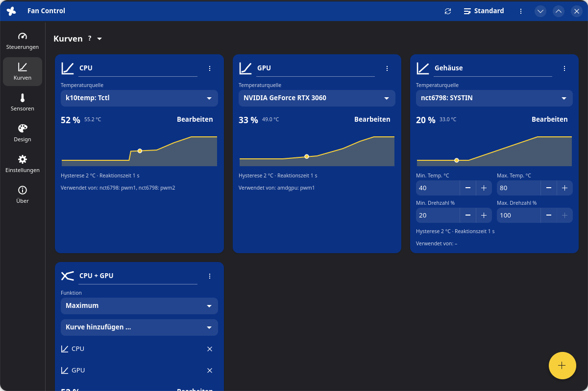
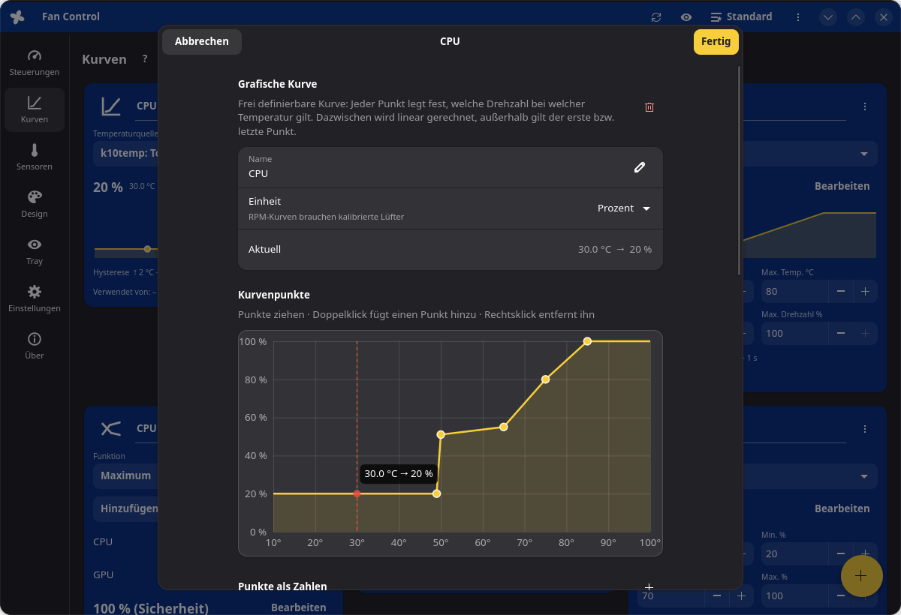
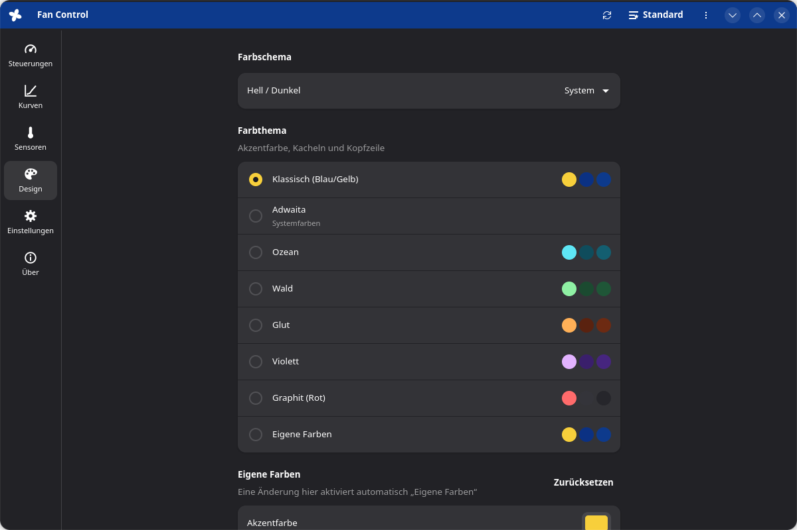

# FanControl for Linux

Eine Lüftersteuerung für Linux, angelehnt an [FanControl](https://getfancontrol.com) für Windows – mit Kacheln, Menü links,
Farbthemen, Kurveneditor, eigenen Sensoren, Profilen, Kalibrierung und Tray-Symbolen.
Es ist eine eigenständige Neuentwicklung: Das Original ist Closed Source, deshalb stammt hier kein Code daraus.



| Kurven | Kurveneditor | Design |
|---|---|---|
|  |  |  |

## Funktionen

**Lüfter (Steuerungen)**
- Mainboard-Lüfter über hwmon (`nct6775`, `it87`, `dell-smm`, `thinkpad_acpi` …), AMD-Grafikkarten (`amdgpu`)
  und **NVIDIA-Grafikkarten** über NVML (proprietärer Treiber, Steuerung über den Dienst)
- Kurve zuweisen oder **manuell** per Regler steuern
- Feinabstimmung: Schritt hoch/runter (%/s), Anlauf %, **Stop %**, Offset, Minimum/Maximum %, Bereiche vermeiden
- **Kalibrierung** misst Anlauf-/Stopp-Punkt und die Drehzahlkurve und erkennt Lüfter mit flacher Kennlinie
- **Anlaufhilfe**: Startet ein kalibrierter Lüfter nicht, wird die Drehzahl schrittweise erhöht
- **Identifizieren**: Der Lüfter läuft 10 s auf 100 %, damit du ihn im Gehäuse findest
- „?“-Anzeige, wenn BIOS oder ein anderes Programm eingreift; **Erzwingen** holt die Steuerung sofort zurück

**Kurven**
- Grafisch (Punkte ziehen, per Zahl eingeben, Temperaturbereich der Achse einstellbar), Linear, Fester Wert,
  Mix (Max/Min/Durchschnitt/Summe/Subtrahieren), Auslöser (Leerlauf/Last), **Sync** (folgt einem anderen Lüfter),
  **Auto** (sucht die niedrigste Drehzahl, die eine Zieltemperatur hält)
- **Hysterese getrennt für steigend/fallend**, jeweils mit Reaktionszeit, optional an den Grenzen ignoriert
- **RPM-Modus**: Die Kurve gibt eine Drehzahl vor, kalibrierte Lüfter fahren sie an
- Großer Editor mit Live-Temperaturmarker und „Abbrechen“

**Eigene Sensoren**: Mix, Zeitdurchschnitt (bis 3600 s), Offset (fest oder proportional), Datei-Sensor

**Oberfläche**
- Menüleiste links: Steuerungen, Kurven, Sensoren, Design, Tray, Einstellungen, Über
- Farbthemen (Klassisch Blau/Gelb, Ozean, Wald, Glut, Violett, Graphit, Adwaita) oder **eigene Farben** für
  Akzent, Kacheln und Kopfzeile, dazu Hell/Dunkel/System
- °C oder °F, Kacheln ausblenden (Augen-Symbol zeigt sie wieder), Hilfe (?) je Bereich und je Kurventyp
- **Tray**: Hauptsymbol mit Menü (Öffnen, Profil wechseln, Beenden) und beliebig viele **Werte-Symbole**
  (Temperatur, % oder RPM) in eigener Farbe; optional beim Anmelden direkt im Tray starten
- **Profile** plus Konfigurationsdateien: neu (leer), öffnen, speichern unter, **importieren** (einzelne
  Kurven/Sensoren/Steuerungen aus einer anderen Datei)
- Einrichtungsassistent, Tastenkürzel (F1 zeigt die Übersicht)

**Sicherheit**
- Fehlt ein Sensor, laufen die betroffenen Lüfter auf voller Drehzahl.
- Ab einer einstellbaren Sicherheitstemperatur laufen alle Lüfter auf 100 %.
- Beim Beenden des Dienstes bekommen BIOS bzw. Treiber die Steuerung zurück.
- Der Dienst läuft als root, die Oberfläche als normaler Benutzer. Die Verbindung zwischen beiden ist auf die Gruppe
  `fancontrol` beschränkt, und jede Konfiguration wird geprüft. Datei-Sensoren dürfen nur aus freigegebenen Ordnern lesen.

### Vergleich mit FanControl für Windows

Übernommen wurden alle Funktionen aus den Release-Notizen bis V281, soweit sie unter Linux Sinn ergeben.
Diese Punkte gibt es hier bewusst nicht:

| Original | Hier |
|---|---|
| Plugins (.NET-DLLs) | Eingebaute Linux-Backends (siehe unten), Datei-Sensoren und `fancontrol-linuxctl` für eigene Skripte |
| LibreHardwareMonitor, PawnIO/WinRing0, ADLX | Linux-Kerneltreiber (hwmon), NVML, liquidctl |
| Updater, Signierung, .NET-Versionen | Installation über `install.sh` |
| Übersetzungen | Oberfläche auf Deutsch |

## Unterstützte Hardware

| Gerätegruppe (Windows-Plugin) | Unter Linux | Steuern | Anzeigen |
|---|---|---|---|
| Mainboard-Lüfter (LibreHardwareMonitor) | hwmon-Treiber `nct6775`, `it87`, `f71882fg`, `w83627ehf` …; der Installer führt `sensors-detect` aus, lädt die Treiber dauerhaft und bietet für neuere ITE-Chips den [it87-Treiber](https://github.com/frankcrawford/it87) per DKMS an | ✓ | ✓ |
| NVIDIA-Grafikkarten | NVML aus dem proprietären Treiber | ✓ | ✓ |
| AMD-Grafikkarten bis RDNA2 | `amdgpu` (pwm1) | ✓ | ✓ |
| AMD RDNA3/RDNA4 (RX 7000/9000) | `amdgpu`-Overdrive-Lüfterkurve; der Installer bietet die nötige Kernel-Option an (`--amd-overdrive`) | ✓ | ✓ |
| Intel Arc (**IntelCtlLibrary**) | `i915`/`xe` hwmon | – ¹ | ✓ |
| Dell (**DellPlugin**) | `dell-smm-hwmon` (Installer lädt das Modul) | ✓ ² | ✓ |
| ASUS (**AsusWMI**) | `nct6775` über ASUS-WMI (automatisch ab Kernel 5.16), `asus-ec-sensors`, `asus-wmi-sensors` | ✓ | ✓ |
| ThinkPad | `thinkpad_acpi` mit `fan_control=1` (Installer, `--thinkpad-fan`) | ✓ | ✓ |
| AIO-Wasserkühlungen, Smart-Hubs (**LiquidCtl**) | liquidctl (NZXT Kraken/Smart Device/RGB & Fan Controller, Corsair Hydro/iCUE Elite/Commander Core, ASUS Ryujin, MSI Coreliquid, EVGA CLC, Gigabyte …) | ✓ | ✓ |
| Aquacomputer (**AquacomputerDevices**) | Kerneltreiber `aquacomputer_d5next`: Octo, Quadro, D5 Next, Farbwerk 360, High Flow Next, Leakshield … | ✓ ³ | ✓ |
| Corsair (**CorsairLink**) | Kerneltreiber `corsair-cpro` (Commander Pro), `corsair-psu`, dazu liquidctl (Commander Core/ST, Hydro Platinum/Elite/Pro) | ✓ | ✓ |
| NZXT | Kerneltreiber `nzxt-kraken3`, `nzxt-smart2` oder liquidctl | ✓ | ✓ |
| Thermaltake (**Thermaltake**) | experimenteller eigener USB-Treiber für Riing-/G3-Controller (in den Einstellungen einschalten, ungetestet) | ✓ | ✓ |
| **HWiNFO**, **GPU-Z** | Das sind reine Windows-Programme. Ihre Sensoren (GPU-Hotspot, VRAM, Chipsatz …) liefern unter Linux die Kerneltreiber und NVML direkt; eigene Quellen lassen sich über Datei-Sensoren einbinden | – | ✓ |
| **Razer** | Unter Linux gibt es keine Schnittstelle für Razer-Lüfter (OpenRazer steuert nur Beleuchtung) | – | – |

¹ Der Intel-Treiber bietet unter Linux (noch) keine Lüftersteuerung. ² Dell-Lüfter kennen meist nur die Stufen aus/niedrig/hoch.
³ Steuern je nach Gerät, Anzeigen bei allen.

In **Einstellungen → Hardware-Unterstützung** zeigt das Programm, was erkannt wurde und was ggf. noch fehlt.

## Voraussetzungen

- Python ≥ 3.10 und systemd, OpenRC oder runit
- Für die Oberfläche: GTK ≥ 4.14 und libadwaita ≥ 1.5. Auf älteren Systemen (z. B. Debian 12, Ubuntu 22.04)
  laufen Dienst und `fancontrol-linuxctl`, aber nicht die Oberfläche.
- Für Tray-Symbole eine Kontrollleiste mit StatusNotifier (KDE, Xfce, Cinnamon, GNOME mit AppIndicator-Erweiterung –
  die installiert der Installer unter GNOME mit)

Installer, Dienst und Kommandozeile sind in Containern getestet auf:

| Distribution | Oberfläche |
|---|---|
| Ubuntu 24.04 (GTK 4.14, Adw 1.5) | ✓ |
| Debian 13 (GTK 4.18, Adw 1.7) | ✓ |
| Debian 12 (GTK 4.8, Adw 1.2) | – nur Dienst und Kommandozeile |
| Fedora (aktuell) | ✓ |
| Arch Linux | ✓ |
| openSUSE Tumbleweed | ✓ |
| Alpine Linux (OpenRC) | ✓ |
| Void Linux (runit) | ✓ |

Linux Mint, Pop!_OS, Manjaro, EndeavourOS, CachyOS, Rocky/Alma usw. werden über ihre Basisdistribution erkannt.

## Installation

```bash
sudo ./install.sh
```

Der Installer erkennt Distribution und Init-System und erledigt:

1. Pakete: Python, GTK 4/libadwaita, lm-sensors, liquidctl, polkit, pciutils/usbutils (über apt, dnf, pacman,
   zypper, xbps, apk oder emerge). Fehlt liquidctl als Paket und sind passende USB-Geräte angeschlossen, wird es in
   eine private Python-Umgebung installiert.
2. Hardware:
   - `sensors-detect --auto`, die gefundenen Treiber werden geladen und über `/etc/modules-load.d/` dauerhaft eingetragen
   - Hersteller-Module für Dell, ASUS und ThinkPad
   - Prüfung von NVIDIA (NVML) und Intel Arc
   - AMD RDNA3/4-Overdrive und den it87-DKMS-Treiber bietet er auf Nachfrage an
3. Programm nach `/usr/local/lib/fancontrol-linux`, Befehle nach `/usr/local/bin`, Eintrag im Anwendungsmenü.
4. Gruppe `fancontrol` anlegen und dich hinzufügen. **Danach einmal ab- und wieder anmelden.**
5. Den Hintergrunddienst einrichten und starten (systemd, OpenRC oder runit). Ein laufender lm-sensors-Dienst
   `fancontrol` wird deaktiviert, weil sich beide gegenseitig stören würden.
6. Am Ende eine Übersicht der erkannten Hardware und Hinweise zu allem, was noch fehlt.

Optionen: `--yes` (keine Rückfragen), `--no-deps`, `--no-hardware`, `--no-service`, `--amd-overdrive`,
`--it87-dkms`, `--thinkpad-fan`. Protokoll: `/var/log/fancontrol-linux-install.log`.

Danach startest du **FanControl** aus dem Anwendungsmenü oder mit `fancontrol-linux` (`--hidden` startet nur im Tray).

Deinstallieren: `sudo ./uninstall.sh`. Das entfernt auch die vom Installer angelegten Treiber-Einstellungen;
mit `--purge` zusätzlich Konfiguration und Gruppe.

### Es werden keine Mainboard-Lüfter gefunden?

Der Installer versucht das automatisch. Wenn es trotzdem nicht klappt:

- In `/var/log/fancontrol-linux-sensors-detect.log` steht, welcher Chip gefunden wurde.
- ITE-Chips (häufig bei Gigabyte, BIOSTAR, ASRock): `sudo ./install.sh --it87-dkms` installiert den aktuellen
  [it87-Treiber](https://github.com/frankcrawford/it87).
- Meldet `sudo dmesg` einen ACPI-Ressourcenkonflikt, hilft der Kernelparameter `acpi_enforce_resources=lax`.
- Danach: `sudo systemctl restart fancontrol-linux` (oder in der Oberfläche „Hardware neu erkennen“).

## Kommandozeile

```bash
fancontrol-linuxctl status              # alle Werte
fancontrol-linuxctl profiles            # Profile auflisten
fancontrol-linuxctl save Leise          # aktuelle Einstellung als Profil speichern
fancontrol-linuxctl load Leise          # Profil laden (z. B. per Tastenkürzel oder Skript)
fancontrol-linuxctl identify nvidia:0:pwm0
fancontrol-linuxctl calibrate nct6798@platform/nct6775.656:pwm2
fancontrol-linuxctl export > backup.json
fancontrol-linuxctl import backup.json
```

### Datei-Sensoren

Ein Skript kann Temperaturen liefern, indem es den Wert (°C, erste Zeile) in eine Datei schreibt:

```bash
echo 45.5 > /run/fancontrol-linux/sensors/wasser.sensor     # für Mitglieder der Gruppe fancontrol beschreibbar
```

Anschließend auf der Seite **Sensoren** über + einen Datei-Sensor mit diesem Pfad anlegen.
Erlaubt sind nur `/run/fancontrol-linux/sensors/`, `/var/lib/fancontrol-linux/sensors/` und `/sys/`.

## Ausprobieren ohne echte Lüfter

```bash
./run-demo.sh          # Oberfläche mit simulierter Hardware (Super-I/O-Chip, CPU, AMD-GPU)
./run-demo.sh --cli    # nur Statusausgabe
```

Die Demo braucht kein root und lässt echte Lüfter und die Grafikkarte unberührt.

## Aufbau

```
fancontrol_linux/
  hwmon.py      Sensoren/PWM über /sys/class/hwmon, stabile IDs, Backends zusammenführen, Unterstützungsübersicht
  amdgpu.py     AMD RDNA3/4: Lüftersteuerung über die Overdrive-Kurve
  nvidia.py     NVIDIA über NVML: Temperatur, Drehzahl, Lüftersteuerung
  liquidctl_backend.py  AIO-Wasserkühlungen und Smart-Hubs über liquidctl
  thermaltake.py        Thermaltake Riing/G3 über hidraw (experimentell)
  sensors.py    eigene Sensoren (Mix, Zeitdurchschnitt, Offset, Datei)
  curves.py     Kurventypen, Hysterese hoch/runter, Auto-Regelung, Sync
  engine.py     Regelschleife, Feinabstimmung, Anlaufhilfe, RPM-Umrechnung, Kalibrierung, Sicherheitstemperatur
  config.py     Validierung, Migration älterer Konfigurationen, Profile
  daemon.py     Dienst, Unix-Socket /run/fancontrol-linux/daemon.sock (Gruppe fancontrol)
  cli.py        fancontrol-linuxctl
  gui/          GTK4/libadwaita-Oberfläche (Seiten, Kurveneditor, Themen, Tray)
tools/fake_hwmon.py   Hardware-Simulator
tools/make_icons.py   erzeugt die Symbole
tests/                Unit- und Integrationstests:  python3 -m unittest discover -s tests
```

## Lizenz

MIT
