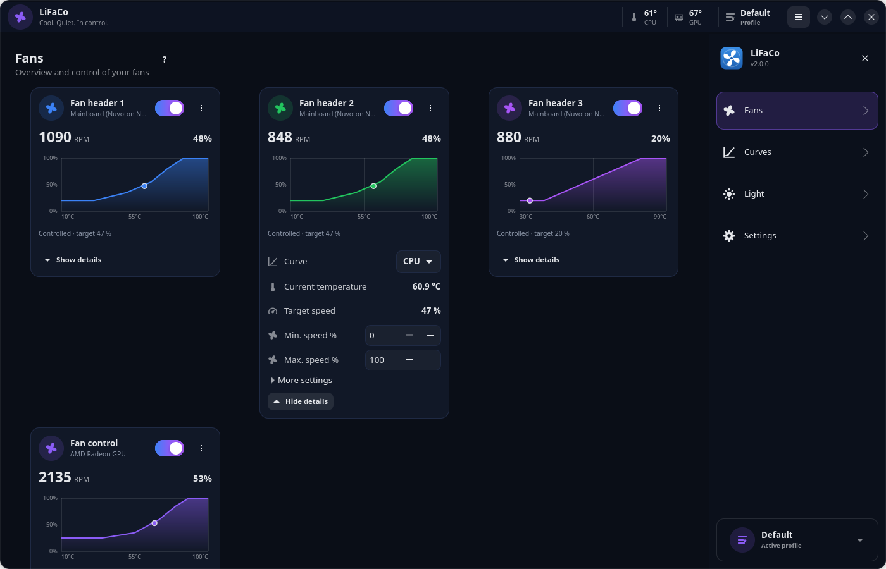
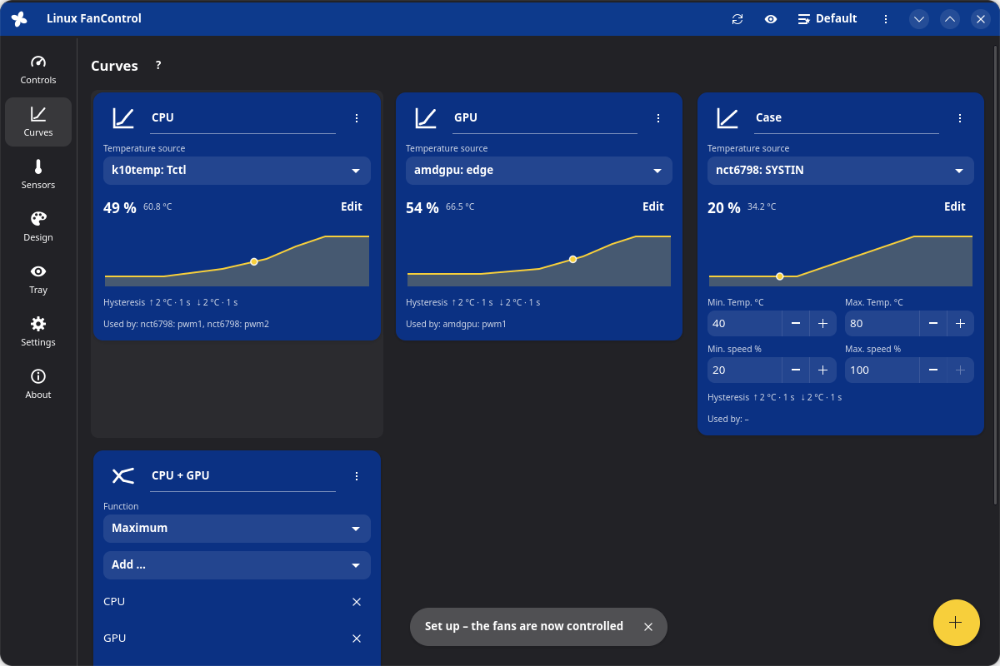
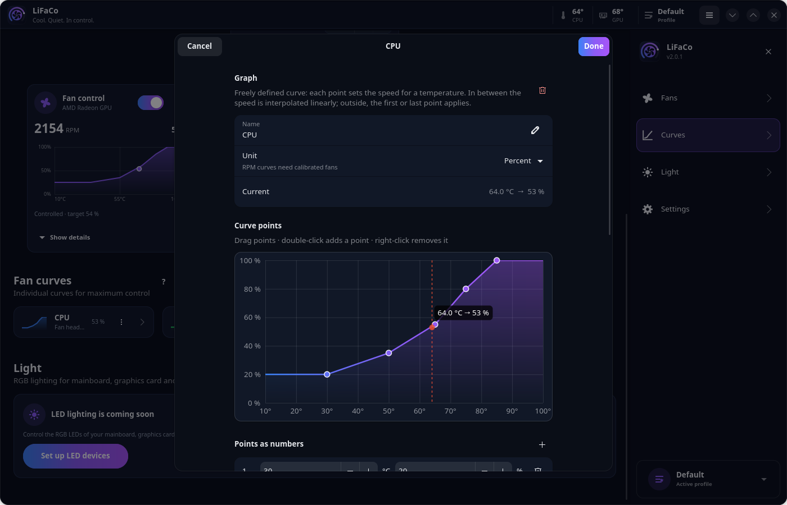
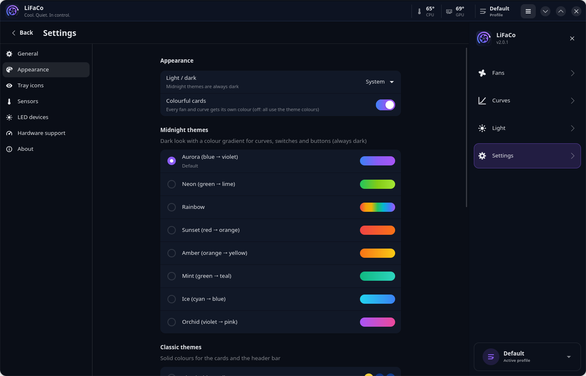
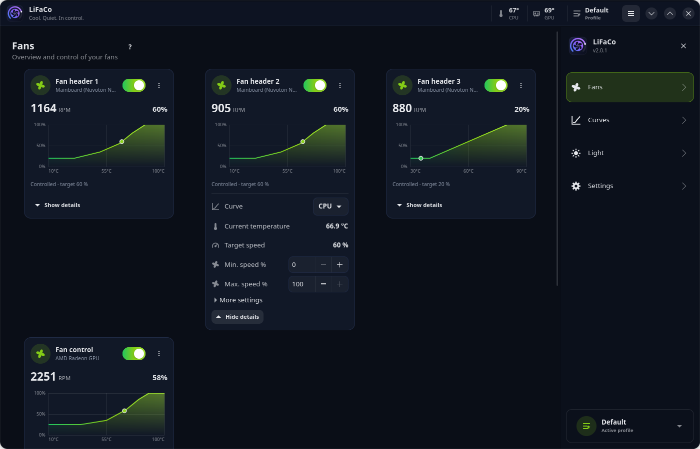

<p align="center">
  
</p>

<h1 align="center">LiFaCo</h1>

<p align="center"><b>Li</b>nux <b>Fa</b>n <b>Co</b>ntrol – <i>Cool. Quiet. In control.</i></p>

Fan control for Linux with fan cards, curves, custom sensors, profiles, calibration, colour themes and tray icons,
inspired by [FanControl](https://getfancontrol.com) for Windows. LiFaCo is an independent implementation: the
original is closed source, so no code was taken from it.



| Fan curves | Curve editor |
|---|---|
|  |  |

| Settings → Appearance | "Neon" theme |
|---|---|
|  |  |

> LiFaCo was previously called *Linux FanControl*. Existing installations move over with one command; see
> [Upgrading](#upgrading).

## Features

**Fans (controls)**
- Mainboard fans via hwmon (`nct6775`, `it87`, `dell-smm`, `thinkpad_acpi` …), AMD graphics cards (`amdgpu`)
  and **NVIDIA graphics cards** via NVML (proprietary driver, controlled by the service)
- Assign a curve or control a fan **manually** with a slider
- Fine tuning: step up/down (%/s), start %, **stop %**, offset, minimum/maximum %, avoid ranges
- **Calibration** measures the start/stop point and the speed curve and detects fans with a flat low range
- **Start assist**: if a calibrated fan does not start, its speed is raised step by step
- **Identify**: the fan runs at 100 % for 10 s so you can find it in the case
- "?" indicator when the BIOS or another program interferes; **Force** takes control back immediately

**Curves**
- Graph (drag points, enter them as numbers, adjustable temperature axis), linear, flat, mix
  (max/min/average/sum/subtract), trigger (idle/load), **sync** (follows another fan), **auto** (finds the lowest
  speed that holds a target temperature)
- **Separate hysteresis for rising and falling temperatures**, each with a response time, optionally ignored at
  the limits
- **RPM mode**: the curve sets a speed in RPM, calibrated fans follow it
- Large editor with a live temperature marker and "Cancel"

**Custom sensors**: mix, time average (up to 3600 s), offset (fixed or proportional), file sensor

**Readable names**: instead of driver names such as `it8689_61030507: pwm1` or `k10temp: Tctl`, sensors and fan
outputs are named after the actual hardware – e.g. "AMD Ryzen 9 5950X: Package (Tctl)", "NVMe KINGSTON SNV2S1000G:
Composite" or "Mainboard (ITE IT8689): Fan header 1" (CPU model, PCI ID database, device models). Which physical
header is "CPU_FAN" or "SYS_FAN2" is not reported by the hardware – use **Identify** and give the fan your own name.

**User interface**
- One scrolling overview with the sections **Fans**, **Curves** and **Light**. Each fan card shows the speed, a
  mini chart of its curve with the live operating point and, on request, the details (curve, current temperature,
  target speed, min./max. speed and all fine tuning options)
- A collapsible menu on the right (burger button, F9): Fans, Curves and Light scroll to their section, **Settings**
  opens its own view (General, Appearance, Tray icons, Sensors, LED devices, Hardware support, About). The active
  profile can be switched at the bottom of the menu and in the header, which also shows CPU and GPU temperature
- **Light**: RGB lighting through **plugins** (see [Lighting](#lighting-plugins)). *Settings → LED devices* lists the
  installed plugins, lets you switch them on and search a catalog for more; the **Light** section then shows one card
  per LED device with effects, colours and brightness
- **Colourful cards**: every fan and curve gets its own colour (can be switched off)
- **Midnight themes** (default): a dark look with a colour gradient for curves, switches and buttons – Aurora
  (blue → violet), Neon (green → lime), Rainbow, Sunset, Amber, Mint, Ice and Orchid
- Classic themes (blue/yellow, ocean, forest, ember, violet, graphite, Adwaita) or **custom colours** for accent
  (optionally as a gradient), cards and header bar, plus light/dark/system
- °C or °F, hide cards (Settings → General → "Show hidden cards" shows them again), help (?) per section and per curve type
- **Tray**: main icon with a menu (open, switch profile, quit) and any number of **value icons**
  (temperature, % or RPM) in your own colours; optionally start in the tray at login
- **Profiles** plus configuration files: new (empty), open, save as, **import** (single curves/sensors/controls
  from another file)
- Setup assistant, keyboard shortcuts (F1 shows the overview)

**Safety**
- If a sensor is missing, the affected fans run at full speed.
- Above an adjustable safety temperature all fans run at 100 %.
- When the service stops, the BIOS or the driver gets control back.
- The service runs as root, the user interface as a normal user. Only members of the `fancontrol` group can talk to
  the service, and every configuration is validated. File sensors may only read from approved directories.

## Supported hardware

| Device group (Windows plugin) | On Linux | Control | Monitor |
|---|---|---|---|
| Mainboard fans (LibreHardwareMonitor) | hwmon drivers `nct6775`, `it87`, `f71882fg`, `w83627ehf` …; the installer runs `sensors-detect`, loads the drivers permanently and offers the [it87 driver](https://github.com/frankcrawford/it87) via DKMS for newer ITE chips | ✓ | ✓ |
| NVIDIA graphics cards | NVML from the proprietary driver | ✓ | ✓ |
| AMD graphics cards up to RDNA2 | `amdgpu` (pwm1) | ✓ | ✓ |
| AMD RDNA3/RDNA4 (RX 7000/9000) | `amdgpu` overdrive fan curve; the installer offers the required kernel option (`--amd-overdrive`) | ✓ | ✓ |
| Intel Arc (**IntelCtlLibrary**) | `i915`/`xe` hwmon | – ¹ | ✓ |
| Dell (**DellPlugin**) | `dell-smm-hwmon` (loaded by the installer) | ✓ ² | ✓ |
| ASUS (**AsusWMI**) | `nct6775` via ASUS WMI (automatic since kernel 5.16), `asus-ec-sensors`, `asus-wmi-sensors` | ✓ | ✓ |
| ThinkPad | `thinkpad_acpi` with `fan_control=1` (installer, `--thinkpad-fan`) | ✓ | ✓ |
| AIO liquid coolers, smart hubs (**LiquidCtl**) | liquidctl (NZXT Kraken/Smart Device/RGB & Fan Controller, Corsair Hydro/iCUE Elite/Commander Core, ASUS Ryujin, MSI Coreliquid, EVGA CLC, Gigabyte …) | ✓ | ✓ |
| Aquacomputer (**AquacomputerDevices**) | kernel driver `aquacomputer_d5next`: Octo, Quadro, D5 Next, Farbwerk 360, High Flow Next, Leakshield … | ✓ ³ | ✓ |
| Corsair (**CorsairLink**) | kernel drivers `corsair-cpro` (Commander Pro), `corsair-psu`, plus liquidctl (Commander Core/ST, Hydro Platinum/Elite/Pro) | ✓ | ✓ |
| NZXT | kernel drivers `nzxt-kraken3`, `nzxt-smart2` or liquidctl | ✓ | ✓ |
| Thermaltake (**Thermaltake**) | experimental built-in USB driver for Riing/G3 controllers (enable it in the settings; untested) | ✓ | ✓ |
| **HWiNFO**, **GPU-Z** | These are Windows-only programs. On Linux their sensors (GPU hotspot, VRAM, chipset …) come directly from the kernel drivers and NVML; other sources can be added as file sensors | – | ✓ |
| **Razer** | Linux has no interface for Razer fans (OpenRazer only controls lighting) | – | – |

¹ The Linux Intel driver does not (yet) offer fan control. ² Dell fans usually only know off/low/high.
³ Control depends on the device, monitoring works for all.

**Settings → Hardware support** shows what was detected and what may still be missing.

## Lighting (plugins)

LiFaCo controls RGB lighting through plugins. Each plugin teaches LiFaCo one kind of hardware; you find and install
them in *Settings → LED devices* (search field, one click) – or write your own.

| Plugin | Controls |
|---|---|
| `wled` | LED strips and matrices running [WLED](https://kno.wled.ge) – WLED's own effects or LiFaCo's |
| `openrgb` | Mainboards, graphics cards, RAM, keyboards, mice, coolers and fans through an [OpenRGB](https://openrgb.org) server (ASUS Aura, Gigabyte, ASRock, Corsair, Razer, Logitech …) |
| `virtual` | Pretend devices for trying it out |

AIO coolers, fan hubs and LED controllers found through liquidctl need no plugin: their colour channels appear as devices automatically (built in, experimental, only volatile colours). The `openrgb` plugin checks whether OpenRGB is installed and can install it for you (with your confirmation): from
your distribution's package repository or, if it is not packaged there, from the OpenRGB project's official releases; while the plugin is on, LiFaCo starts the OpenRGB server for you (only after you approve it when switching the plugin on;
as a temporary background process with administrator rights, reachable from this computer only, stopped again when you
switch the plugin off - no permanent service is created). Devices OpenRGB cannot find by itself - network lamps and LED
controllers (E1.31, DDP, LIFX, Yeelight, Govee, Elgato, WiZ, Kasa) and Arduino LED strips on a serial port - are added
in LiFaCo (Settings → LED devices → OpenRGB → Devices you add yourself); the number of LEDs on addressable headers is
set on the device card, and "Search the hardware again" makes OpenRGB look for new hardware. The `wled` plugin finds
WLED devices on the network by itself (mDNS, every minute). Planned: OpenRazer and a careful MSI Mystic Light plugin.

LiFaCo draws the effects itself (static, breathing, rainbow, **colour that follows a temperature or a fan's speed**,
with an editable colour gradient) and streams them to the devices; devices that have their own effects can run those
instead. The Light section shows an overview and one tile per device with an on/off switch; lighting is saved
**per profile**, can be switched off when LiFaCo stops, is restored after suspend, and "Lights on/off" is in the tray menu.

**Safety:** plugins run in their own process **without administrator rights** and can only do what you approve when
you switch them on (network, specific USB devices, SMBus). LiFaCo never sends "save to device" commands, so colours
are gone after a power cycle instead of being written into a controller's flash memory.

**Write your own plugin** – a folder with two files:

```bash
lifacoctl plugin new my-strip && cd my-strip
lifacoctl plugin dev . --color ff8800      # try it without the service
lifacoctl plugin install .                 # or: Settings → LED devices → Add a plugin from a file
```

Guide and catalog: [LiFaCo-plugins](https://github.com/SloppyHenry/LiFaCo-plugins) ·
design and research: [docs/lighting-design.md](docs/lighting-design.md).
Command line: `lifacoctl plugin list|search|install|enable|disable|set|remove`, `lifacoctl light list|set|identify`.

## Requirements

- Python ≥ 3.10 and systemd, OpenRC or runit
- For the user interface: GTK ≥ 4.14 and libadwaita ≥ 1.5. On older systems (e.g. Debian 12, Ubuntu 22.04)
  use the **AppImage**, which brings everything with it.
- For tray icons a panel with StatusNotifier support (KDE, Xfce, Cinnamon, GNOME with the AppIndicator extension –
  the installer adds it on GNOME)

Installer, service and command line are tested in containers on:

| Distribution | User interface |
|---|---|
| Ubuntu 24.04 (GTK 4.14, Adw 1.5) | ✓ |
| Debian 13 (GTK 4.18, Adw 1.7) | ✓ |
| Debian 12 (GTK 4.8, Adw 1.2) | ✓ via the AppImage |
| Ubuntu 22.04 (GTK 4.6) | ✓ via the AppImage |
| Fedora (current) | ✓ |
| Arch Linux | ✓ |
| openSUSE Tumbleweed | ✓ |
| Alpine Linux (OpenRC) | ✓ |
| Void Linux (runit) | ✓ |

Linux Mint, Pop!_OS, Manjaro, EndeavourOS, CachyOS, Rocky/Alma etc. are recognised through their base distribution.

## AppImage (a single file, also runs on older systems)

The AppImage ships Python, GTK 4, libadwaita and liquidctl and runs without additional packages on practically any
x86_64 Linux – including Debian 12 and Ubuntu 22.04, where the regular installation has no user interface.
Download it from the [releases page](https://github.com/SloppyHenry/LiFaCo/releases).

```bash
chmod +x LiFaCo-x86_64.AppImage
./LiFaCo-x86_64.AppImage                  # start the user interface
sudo ./LiFaCo-x86_64.AppImage --install   # set up service + hardware (same options as install.sh)
```

A background service with root privileges controls the fans, and an AppImage cannot run that on its own.
`--install` therefore copies the AppImage to `/opt/fancontrol-linux` and sets up the service, commands, menu entry
and drivers just like `install.sh`. If you start the user interface without the service, it offers an
**"Install service"** button. Remove it with `sudo ./LiFaCo-x86_64.AppImage --uninstall [--purge]`.

Other modes: `--ctl <command>` (like `lifacoctl`), `--daemon`.

Build it yourself (needs Docker or Podman): `./packaging/appimage/build.sh` → `dist/LiFaCo-x86_64.AppImage`

## Installation from source

```bash
git clone https://github.com/SloppyHenry/LiFaCo.git
cd LiFaCo
sudo ./install.sh
```

The installer detects the distribution and the init system and takes care of:

1. Packages: Python, GTK 4/libadwaita, lm-sensors, liquidctl, polkit, pciutils/usbutils (via apt, dnf, pacman,
   zypper, xbps, apk or emerge). If liquidctl is not packaged and matching USB devices are connected, it is installed
   into a private Python environment.
2. Hardware:
   - `sensors-detect --auto`; the drivers it finds are loaded and made permanent in `/etc/modules-load.d/`
   - known problems are fixed directly (see [below](#known-problems-the-installer-fixes))
   - vendor modules for Dell, ASUS and ThinkPad
   - checks for NVIDIA (NVML) and Intel Arc
   - AMD RDNA3/4 overdrive is offered on request
3. Program in `/usr/local/lib/fancontrol-linux`, commands in `/usr/local/bin` (`lifaco`, `lifacoctl`,
   `lifaco-upgrade`; the older names `fancontrol-linux*` keep working), an entry in the application menu.
4. Creates the group `fancontrol` and adds you to it. **Log out and back in once afterwards.**
5. Sets up and starts the background service (systemd, OpenRC or runit). A running lm-sensors `fancontrol`
   service is disabled because both would interfere with each other.
6. Finally an overview of the detected hardware and notes about anything still missing.

Options: `--yes` (no questions), `--no-deps`, `--no-hardware`, `--no-service`, `--amd-overdrive`, `--it87-dkms`,
`--thinkpad-fan`. Log: `/var/log/fancontrol-linux-install.log`.

Then start **LiFaCo** from the application menu or with `lifaco` (`--hidden` starts it in the tray only).

Uninstall: `sudo ./uninstall.sh`. This also removes the driver settings created by the installer; `--purge`
additionally removes the configuration and the group.

## Upgrading

```bash
sudo lifaco-upgrade                    # upgrade to the latest release
lifaco-upgrade --check                 # only check whether an update is available
sudo lifaco-upgrade --version v2.0.0   # install a specific release
```

The upgrade script detects whether LiFaCo was installed from source or from the AppImage and fetches
the matching release from GitHub (AppImage downloads are checked against their SHA-256 checksum). Configuration,
profiles and driver settings are kept, and the service is restarted. Afterwards restart the user interface.

**Coming from Linux FanControl (1.x)?** Run once:

```bash
curl -fsSL https://raw.githubusercontent.com/SloppyHenry/LiFaCo/main/upgrade.sh | sudo bash
```

This installs LiFaCo, which fetches all further updates from this repository (`sudo lifaco-upgrade`) and adds the
`lifaco*` commands. Configuration and profiles are kept – the technical names (service `fancontrol-linux`, group
`fancontrol`, paths) did not change.

### Known problems the installer fixes

The installer recognises common problems and fixes them directly (a summary at the end says if a reboot is needed):

- **Newer ITE chips** (typical for BIOSTAR, Gigabyte, ASRock – e.g. IT8613E, IT8686E, IT8688E, IT8689E) that the
  kernel's own `it87` driver does not support yet: the newer [it87 driver](https://github.com/frankcrawford/it87)
  is built and installed via DKMS (also with `--yes`), and loaded with `ignore_resource_conflict=1`. DKMS rebuilds
  it for every new kernel. With **Secure Boot** it offers to register the signing key (MOK).
- **ACPI resource conflict** (the sensor chip is blocked, common with Nuvoton chips): it offers to add the kernel
  parameter `acpi_enforce_resources=lax` (GRUB, grubby or kernelstub; `uninstall.sh` removes it again).
- **NVIDIA:** it checks which driver version is installed and loaded (e.g. 595.91.07) and installs the NVML
  library and `nvidia-utils` of exactly that version (Ubuntu: `libnvidia-compute-<branch>`/`nvidia-utils-<branch>`,
  also `-server`; Debian, Fedora/RPM Fusion, Arch and openSUSE with their package names). If driver and library
  versions differ it asks for a reboot. Drivers installed with NVIDIA's `.run` installer are left alone. Without the
  proprietary driver it offers `ubuntu-drivers install` on Ubuntu.
- AMD RDNA3/4 overdrive, ThinkPad fan control, Dell and ASUS modules (see above).

Boot changes (kernel parameters, graphics drivers) are only made when you confirm them at the terminal, never
with `--yes`.

If the mainboard fans are still missing: `/var/log/fancontrol-linux-sensors-detect.log` shows which chip was
found, and `sudo dmesg | grep -iE "it87|nct67"` shows why its driver did not load. After fixing it:
`sudo systemctl restart fancontrol-linux` (or "Rescan hardware" in the user interface).

## Command line

```bash
lifacoctl status              # all values
lifacoctl profiles            # list profiles
lifacoctl save Quiet          # save the current settings as a profile
lifacoctl load Quiet          # load a profile (e.g. from a keyboard shortcut or script)
lifacoctl identify nvidia:0:pwm0
lifacoctl calibrate nct6798@platform/nct6775.656:pwm2
lifacoctl export > backup.json
lifacoctl import backup.json
```

### File sensors

A script can provide temperatures by writing the value (°C, first line) to a file:

```bash
echo 45.5 > /run/fancontrol-linux/sensors/water.sensor     # writable for members of the fancontrol group
```

Then add a file sensor with this path under **Settings → Sensors** using +.
Only `/run/fancontrol-linux/sensors/`, `/var/lib/fancontrol-linux/sensors/` and `/sys/` are allowed.

## Trying it without real fans

```bash
./run-demo.sh          # user interface with simulated hardware (Super I/O chip, CPU, AMD GPU)
./run-demo.sh --cli    # status output only
```

The demo needs no root and never touches real fans or the graphics card.

## Project layout

```
fancontrol_linux/
  hwmon.py              sensors/PWM via /sys/class/hwmon, stable IDs, merges the backends, support overview
  amdgpu.py             AMD RDNA3/4: fan control through the overdrive curve
  nvidia.py             NVIDIA via NVML: temperature, fan speed, fan control
  liquidctl_backend.py  AIO liquid coolers and smart hubs via liquidctl
  thermaltake.py        Thermaltake Riing/G3 via hidraw (experimental)
  sensors.py            custom sensors (mix, time average, offset, file)
  curves.py             curve types, hysteresis up/down, auto regulation, sync
  engine.py             control loop, fine tuning, start assist, RPM conversion, calibration, safety temperature
  config.py             validation, migration of older configurations, profiles
  daemon.py             service, Unix socket /run/fancontrol-linux/daemon.sock (group fancontrol)
  cli.py                lifacoctl (fancontrol-linuxctl)
  gui/                  GTK4/libadwaita user interface (overview, side menu, settings, curve editor, themes, tray)
packaging/appimage/     AppImage build
tools/fake_hwmon.py     hardware simulator
tools/make_icons.py     generates the icons
tests/                  unit and integration tests:  python3 -m unittest discover -s tests
```

## License

MIT
